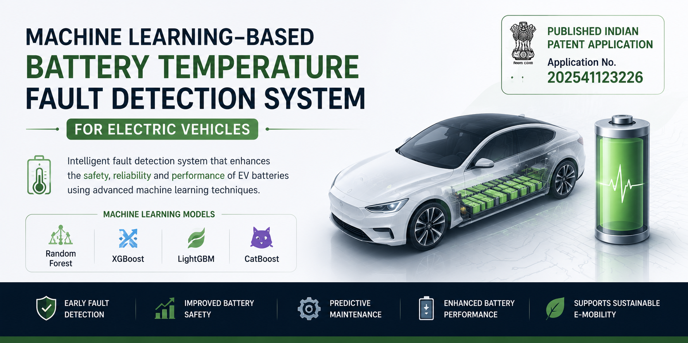
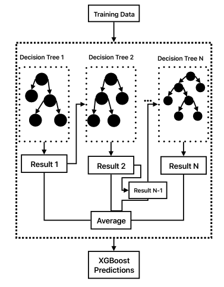
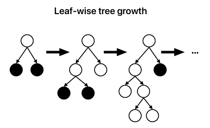
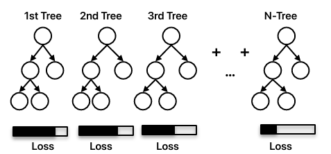
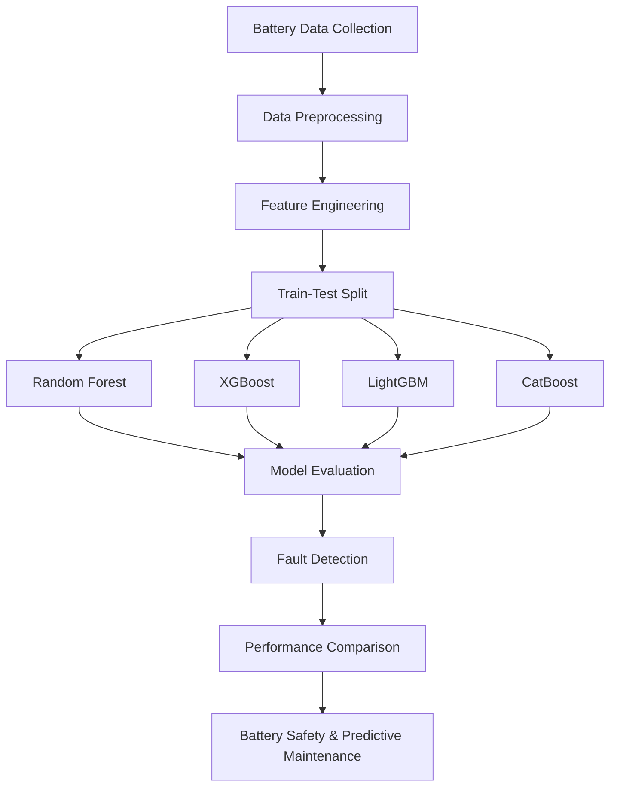
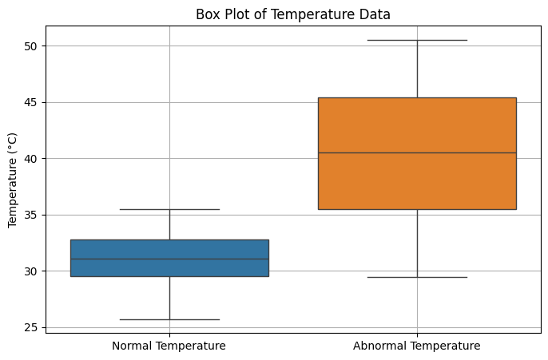
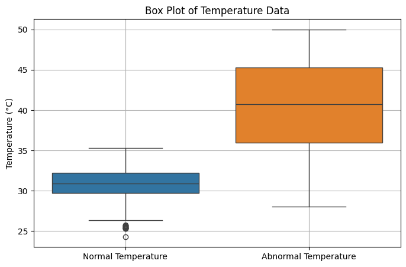
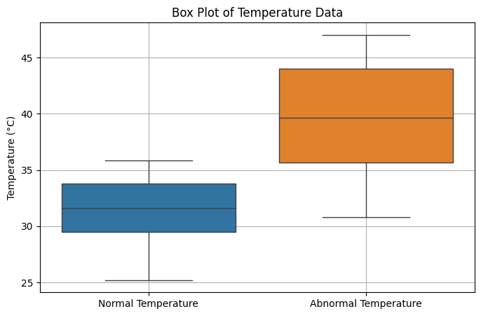
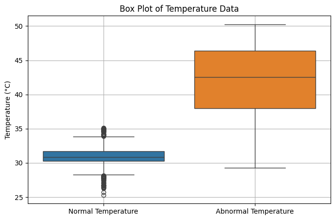

<p align="center">
  
</p>

# Machine Learning-Based Battery Temperature Fault Detection System for Electric Vehicles


> Published Indian Patent Application | Machine Learning | Electric Vehicles | Battery Management System | Predictive Maintenance
---

## Table of Contents

- [Overview](#overview)
- [My Contributions](#my-contributions)
- [Patent Information](#patent-information)
- [Features](#features)
- [Machine Learning Models](#machine-learning-models)
- [Technology Stack](#technology-stack)
- [System Workflow](#system-workflow)
- [System Architecture](#system-architecture)
- [Experimental Hardware Setup](#experimental-hardware-setup)
- [Repository Structure](#repository-structure)
- [Applications](#applications)
- [Results](#results)
- [Future Enhancements](#future-enhancements)
- [License](#license)
- [Citation](#citation)
- [Author](#author)
---

## Overview

Machine Learning-Based Battery Temperature Fault Detection System for Electric Vehicles is a patent-based project developed to detect abnormal battery temperature conditions using machine learning techniques.

The project analyzes battery temperature data collected under normal and abnormal operating conditions to identify potential battery faults before failure occurs. Four machine learning algorithms are implemented and compared to determine the most accurate prediction model.

This repository presents the implementation and machine learning workflow developed for the published Indian Patent Application titled **"Machine Learning-Based Battery Temperature Fault Detection System for Electric Vehicles."**

---
## Implementation Contributions

This repository showcases my implementation and technical work related to the published patent application.

My contributions include:

- Battery temperature dataset preparation and preprocessing
- Feature engineering and data analysis
- Development of Random Forest, XGBoost, LightGBM, and CatBoost models
- Model training, testing, and performance evaluation
- Experimental analysis and result visualization
- Project implementation and technical documentation

## Patent Information

| Item | Details |
|------|---------|
| Patent Title | Machine Learning-Based Battery Temperature Fault Detection System for Electric Vehicles |
| Application Number | 202541123226 |
| Filing Date | 06 December 2025 |
| Publication Date | 02 January 2026 |
| Patent Status | Published Indian Patent Application |
| Current Status | Awaiting Request for Examination |
| Applicant | Vellore Institute of Technology |
| Official Source | Indian Patent Office (IPO), Government of India |

The official patent publication (`Patent_Application_Publication.pdf`) is available in the `docs/` folder of this repository.

---

## Features

- Battery temperature fault detection
- Predictive maintenance
- Real-time battery health analysis
- Machine learning based fault prediction
- Comparison of multiple ML algorithms
- Data preprocessing and feature engineering
- Performance evaluation using multiple metrics
- EV battery safety enhancement

---
## Project Highlights

- Published Indian Patent Application
- Four Machine Learning Algorithms
- Six Experimental Battery Temperature Datasets
- Battery Fault Detection for Electric Vehicles
- Predictive Maintenance Framework
- Python-based Implementation
---

## Machine Learning Models

| Model | Purpose |
|--------|---------|
| Random Forest | Ensemble learning model used for accurate battery temperature fault detection. |
| XGBoost | Gradient boosting model for high-performance prediction and fault classification. |
| LightGBM | Fast gradient boosting framework optimized for efficient model training. |
| CatBoost | Gradient boosting algorithm with robust handling of complex feature relationships. |

### Model Evaluation Metrics

The models are evaluated using:

- Accuracy
- Precision
- Recall
- F1-Score
- Mean Absolute Error (MAE)
- Mean Squared Error (MSE)
- R² Score

---
### Machine Learning Algorithm Diagrams

<p align="center">
  
  
</p>

<p align="center">
  
  
</p>

---

## Technology Stack

| Category | Technologies |
|-----------|--------------|
| Programming Language | Python |
| Machine Learning Libraries | Scikit-learn, XGBoost, LightGBM, CatBoost |
| Data Analysis | NumPy, Pandas |
| Data Visualization | Matplotlib |
| Development Environment | Google Colab, Jupyter Notebook, Visual Studio Code |
| Version Control | Git, GitHub |

---

## Installation

```bash
git clone https://github.com/shashikiranam/ML-Based-EV-Battery-Fault-Detection-System.git

cd ML-Based-EV-Battery-Fault-Detection-System

pip install -r requirements.txt
```

## Usage

1. Open the notebook inside the `notebooks/` folder.
2. Install the required Python packages using `requirements.txt`.
3. Upload the battery temperature datasets from the `dataset/raw/` folder.
4. Run the notebook from top to bottom.
5. Review the generated predictions, evaluation metrics, and graphs.

---

## System Workflow


## System Architecture

<p align="center">
  
</p>

The proposed system collects battery temperature data from multiple sensor locations under load and no-load conditions. The data undergoes preprocessing before being used to train and evaluate multiple machine learning algorithms for battery fault detection.
---
## Experimental Hardware Setup

<p align="center">
  
</p>

The experimental setup consists of an EV battery pack, temperature sensors (T1, T2, and T3), data acquisition hardware, and a computer running Python-based machine learning models for battery temperature fault detection.
---

## Repository Structure

```text
ML-Based-EV-Battery-Fault-Detection-System
│
├── docs/
│   ├── Patent_Application_Publication.pdf
│   ├── Complete_Specification.pdf
│   ├── PATENT.md
│   ├── PROJECT_REPORT.md
│   └── Research_Paper.md
│
├── dataset/
│   ├── raw/
│   └── processed/
│
├── src/
│
├── notebooks/
│
├── models/
│   └── trained/
│
├── results/
│   ├── graphs/
│   ├── reports/
│   └── predictions/
│
├── images/
│   ├── architecture/
│   ├── hardware/
│   ├── ml_models/
│   └── results/
│
├── README.md
├── LICENSE
├── .gitignore
├── requirements.txt
└── CITATION.cff
```

---
## Performance Metrics

The machine learning models are evaluated using:

- Accuracy
- Precision
- Recall
- F1-Score
- Mean Absolute Error (MAE)
- Mean Squared Error (MSE)
- R² Score

---

## Applications

- Electric Vehicles
- Battery Management Systems (BMS)
- Predictive Maintenance
- Battery Health Monitoring
- Smart Mobility
- Automotive Safety
- Intelligent Fault Diagnosis

---
## Results

The developed system demonstrates high accuracy in detecting abnormal battery temperature conditions using machine learning algorithms.

### Performance Summary

| Model | Application |
|--------|-------------|
| Random Forest | Battery temperature fault detection |
| XGBoost | Fault prediction and classification |
| LightGBM | Fast model training and prediction |
| CatBoost | Robust ensemble learning |

### Evaluation Metrics

- Accuracy
- Precision
- Recall
- F1-Score
- Mean Absolute Error (MAE)
- Mean Squared Error (MSE)
- R² Score

### Output

- Early battery fault detection
- Abnormal temperature identification
- Predictive maintenance support
- Improved battery safety
- Machine learning model comparison

> Detailed graphs, performance reports, and prediction results are available in the `results/` directory.

## Experimental Results

### Sample Prediction Graphs

<p align="center">
  
  
</p>

<p align="center">
  
  
</p>

More experimental graphs are available in the `images/results/` directory.

## Future Enhancements

- Deep Learning-based fault prediction
- Real-time IoT integration
- Cloud-based battery monitoring dashboard
- Edge AI deployment
- Battery Remaining Useful Life (RUL) prediction
- Integration with Battery Management Systems (BMS)

---

## License

This project is licensed under the MIT License.

---

## Citation

If you use this project for research or academic purposes, please cite this repository and the associated published patent application.

---

## Acknowledgements

- Vellore Institute of Technology (VIT)
- Office of the Controller General of Patents, Designs & Trade Marks, Government of India
- Open-source Machine Learning Community

---

## Author

**Shashi Kiran A M**

Embedded Systems Engineer | Automotive Electronics Engineer | Machine Learning Enthusiast

GitHub: https://github.com/shashikiranam

---

⭐ If you found this project useful, consider giving it a Star.
